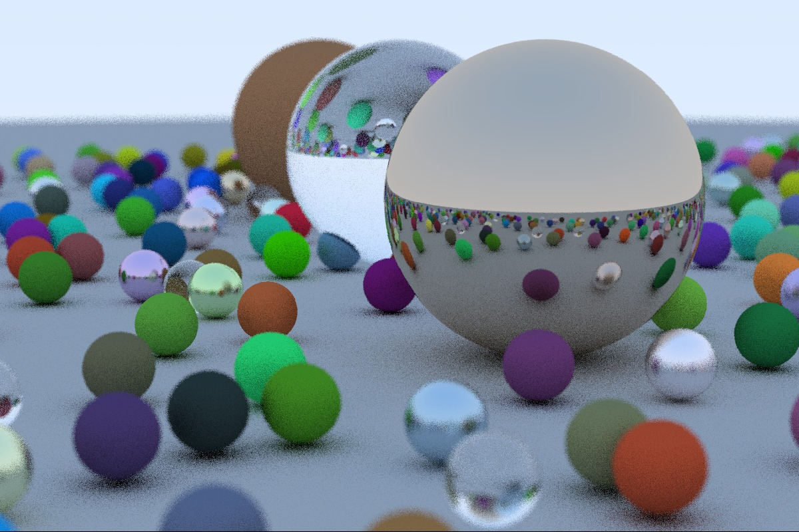

# Raytracing in One Weekend

Implementation of Peter Shirley's raytracing tutorial in C#

## Current Example Output

## Chapters

The code after completing each chapter can be found in it's own commit.

| Chapter | Title                                 | Commit                                   |
|:-------:|:--------------------------------------|:-----------------------------------------|
| 1       | Output an Image                       | 5af3a98fd1dfab8ec8d27c45928650c5ebb9597b |
| 2       | The Vec3 Class                        | 7c1d4f8ba662aecc8fbb0f8fbb206f533dee10eb |
| 3       | Rays, a Simple Camera, and Background | 0c8f251b596e09d076c5b1c82c81d5d425d2a3cb |
| 4       | Adding a Sphere                       | 5f4b4c3b154b991efd838d90ddc7f292ad77bd92 |
| 5       | Surface Normals and Multiple Objects  | f03a5eabe50d84c7bd940777964fc6e99f7ea3e4 |
| 6       | Antialiasing                          | 94dd246c9a4d0bcea53758a156c88734a656e561 |
| 7       | Diffuse Materials                     | 6e3fa53539bc61e8e108d4d0cfb9600191394ea1 |
| 8       | Metal                                 | 5e33dac95d7e599b2952ba29958bcf3475214e41 |
| 9       | Dielectrics                           | c615d8b30665195ee6c1f8b4465e51ce2116b42c |
| 10      | Positionable Camera                   | b1e615df8a51a8a13a9703f72d185cd01207e836 |
| 11      | Defocus Blur                          | cf8b6390770b53653ab820822f1804ba7ac53e2b |
| 12      | Where Next?                           | 1eca2ed1d639ceed3aa568485ce7527cfeb01c27 |

## Modifications

The example code from the tutorial has been modified to parallelize the line-by-line rendering of the output image.

## Original Tutorial & Code

The links to the original tutorial as a PDF and further ressources like the author's source code can be found at [http://in1weekend.blogspot.com/2016/01/ray-tracing-in-one-weekend.html](http://in1weekend.blogspot.com/2016/01/ray-tracing-in-one-weekend.html)