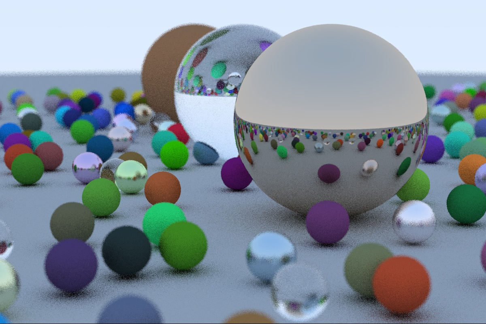

# RaySharp - Ray Tracing in C#

Implementation of Peter Shirley's raytracing tutorials in C#

## Chapters

The code after completing each chapter can be found in it's own commit.

### Ray Tracing in One Weekend

| Chapter | Title                                 | Commit                                   |
|:-------:|:--------------------------------------|:-----------------------------------------|
| 1       | Output an Image                       | [5af3a98](https://github.com/bschne/RaySharp/commit/5af3a98fd1dfab8ec8d27c45928650c5ebb9597b) |
| 2       | The Vec3 Class                        | [7c1d4f8](https://github.com/bschne/RaySharp/commit/7c1d4f8ba662aecc8fbb0f8fbb206f533dee10eb) |
| 3       | Rays, a Simple Camera, and Background | [0c8f251](https://github.com/bschne/RaySharp/commit/0c8f251b596e09d076c5b1c82c81d5d425d2a3cb) |
| 4       | Adding a Sphere                       | [5f4b4c3](https://github.com/bschne/RaySharp/commit/5f4b4c3b154b991efd838d90ddc7f292ad77bd92) |
| 5       | Surface Normals and Multiple Objects  | [f03a5ea](https://github.com/bschne/RaySharp/commit/f03a5eabe50d84c7bd940777964fc6e99f7ea3e4) |
| 6       | Antialiasing                          | [94dd246](https://github.com/bschne/RaySharp/commit/94dd246c9a4d0bcea53758a156c88734a656e561) |
| 7       | Diffuse Materials                     | [6e3fa53](https://github.com/bschne/RaySharp/commit/6e3fa53539bc61e8e108d4d0cfb9600191394ea1) |
| 8       | Metal                                 | [5e33dac](https://github.com/bschne/RaySharp/commit/5e33dac95d7e599b2952ba29958bcf3475214e41) |
| 9       | Dielectrics                           | [c615d8b](https://github.com/bschne/RaySharp/commit/c615d8b30665195ee6c1f8b4465e51ce2116b42c) |
| 10      | Positionable Camera                   | [b1e615d](https://github.com/bschne/RaySharp/commit/b1e615df8a51a8a13a9703f72d185cd01207e836) |
| 11      | Defocus Blur                          | [cf8b639](https://github.com/bschne/RaySharp/commit/cf8b6390770b53653ab820822f1804ba7ac53e2b) |
| 12      | Where Next?                           | [1eca2ed](https://github.com/bschne/RaySharp/commit/1eca2ed1d639ceed3aa568485ce7527cfeb01c27) |

### Ray Tracing: The Next Week

| Chapter | Title                                 | Commit                                   |
|:-------:|:--------------------------------------|:-----------------------------------------|
| 1       | Motion Blur                           | [1e5ed40](https://github.com/bschne/RaySharp/commit/1e5ed40768e2eaf4cf6c05b6d63d0097ae4ba8cc) |
| 2       | Bounding Volume Hierarchies           | PENDING                                  |
| 3       | Solid Textures                        | PENDING                                  |
| 4       | Perlin Noise                          | PENDING                                  |
| 5       | Image Texture Mapping                 | PENDING                                  |
| 6       | Rectangles and Lights                 | PENDING                                  |
| 7       | Instances                             | PENDING                                  |
| 8       | Volumes                               | PENDING                                  |
| 9       | A Scene Testing All New Features      | PENDING                                  |

## Modifications

The example code from the tutorial has been modified as follows:

- The implementation uses doubles instead of floats (to avoid unnecessary casts as the math operations provided by .NET Core mostly use doubles)
- The line-by-line rendering of the output image is parallelized
- The output goes to a JPG file instead of piping standard out to a PPM file
- The rendering progress is shown on the console

## Original Tutorial & Code

The author has made the PDFs of all tutorials available on a "pay what you want" basis (see [original tweet](https://twitter.com/peter_shirley/status/984947257035243520?lang=de)) on google drive here: https://drive.google.com/drive/folders/14yayBb9XiL16lmuhbYhhvea8mKUUK77W

The author's original source code in C++ can be found on his github profile here: https://github.com/petershirley